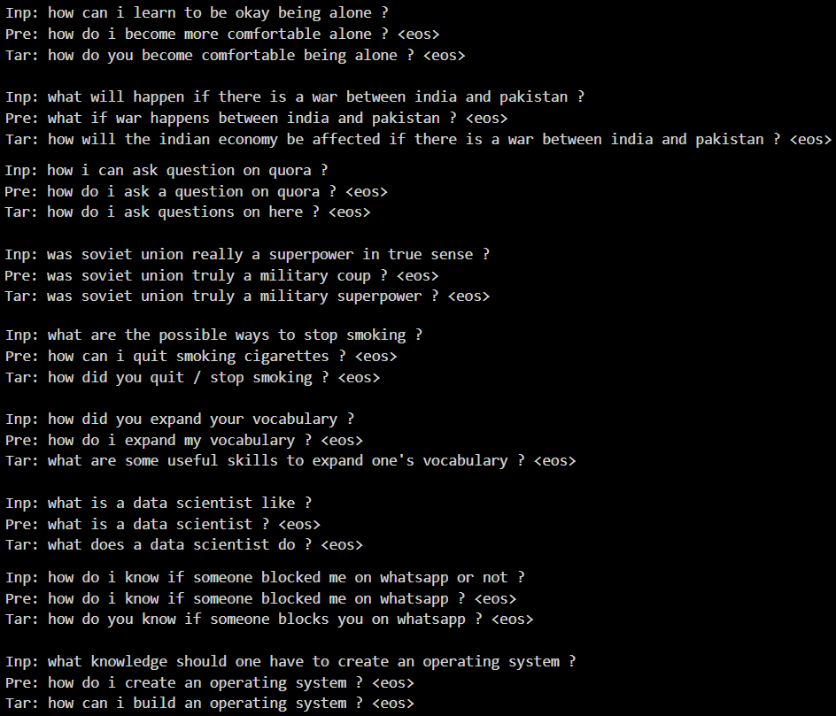

# SeqGAN VAE Paraphrasing


## About The Project


### Introduction

My project is called **Paraphrasing**. This is an implementation of ["An End-to-End Generative Architecture for Paraphrase Generation"](https://aclanthology.org/D19-1309/).


## Getting Started

To get started, you should have prior knowledge on **Python** and **Pytorch** at first. A few resources to get you started if this is your first Python or Tensorflow project:

- [Pytorch Tutorials](https://pytorch.org/tutorials/)
- [Python for Beginners](https://www.python.org/about/gettingstarted/)


## Installation and Run

1. Clone the repo

   ```sh
   git clone https://github.com/phkhanhtrinh23/seqgan_vae_paraphrasing.git
   ```
  
2. Use any code editor to open the folder **seqgan_vae_paraphrasing**.


## Step-by-step

1. Read and run `data.py` to convert `data/train.csv` to a compatible format. The dataset originates from [Quora Question Pairs (QQP)](https://www.kaggle.com/competitions/quora-question-pairs/data)

2. Read and run `train.py` to train the **SeqGAN VAE** model. The model architecture originates from ["An End-to-End Generative Architecture for Paraphrase Generation"](https://aclanthology.org/D19-1309/).


## Results


Description:
- `Inp`: the input data.
- `Pre`: the prediction from the model.
- `Tar`: the targe/label data (groundtruth).

*Note 1: `<eos>` is just the end-of-sentence token.*

*Note 2: As you can witness, QQP just covers paraphrasing on **question** so this model may not work well on normal sentences. Moreover, some of the QQP's data are not good enough to the model because of the low quality of inputs and labels. Sometimes, our model has much better paraphrases than the QQP's labels.*


## Contribution

Contributions are what make GitHub such an amazing place to be learn, inspire, and create. Any contributions you make are greatly appreciated.

1. Fork the project
2. Create your Contribute branch: `git checkout -b contribute/Contribute`
3. Commit your changes: `git commit -m 'add your messages'`
4. Push to the branch: `git push origin contribute/Contribute`
5. Open a pull request


## Contact

Email: phkhanhtrinh23@gmail.com

Project Link: https://github.com/phkhanhtrinh23/seqgan_vae_paraphrasing.git